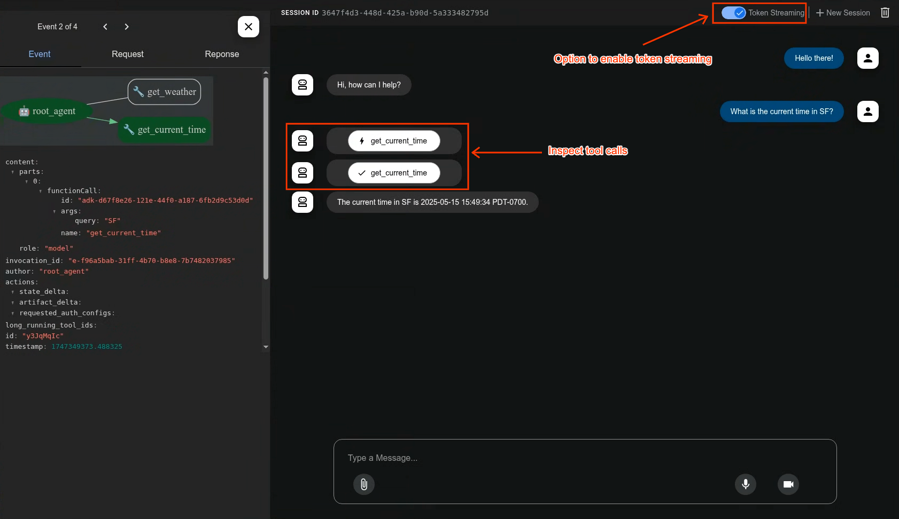

# Agent Development Kit (ADK)

[](LICENSE)
[](https://github.com/google/adk-python/actions/workflows/python-unit-tests.yml)
[](https://www.reddit.com/r/agentdevelopmentkit/)

<html>
    <h1 align="center">
      
    </h1>
    <h3 align="center">
      An open-source, code-first Python toolkit for building, evaluating, and deploying sophisticated AI agents with flexibility and control.
    </h3>
    <h3 align="center">
      Important Links:
      <a href="https://google.github.io/adk-docs/">Docs</a> &
      <a href="https://github.com/google/adk-samples">Samples</a>.
    </h3>
</html>

Agent Development Kit (ADK) is designed for developers seeking fine-grained
control and flexibility when building advanced AI agents that are tightly
integrated with services in Google Cloud. It allows you to define agent
behavior, orchestration, and tool use directly in code, enabling robust
debugging, versioning, and deployment anywhere – from your laptop to the cloud.


---

## ✨ Key Features

- **Rich Tool Ecosystem**: Utilize pre-built tools, custom functions,
  OpenAPI specs, or integrate existing tools to give agents diverse
  capabilities, all for tight integration with the Google ecosystem.

- **Code-First Development**: Define agent logic, tools, and orchestration
  directly in Python for ultimate flexibility, testability, and versioning.

- **Modular Multi-Agent Systems**: Design scalable applications by composing
  multiple specialized agents into flexible hierarchies.

- **Deploy Anywhere**: Easily containerize and deploy agents on Cloud Run or
  scale seamlessly with Vertex AI Agent Engine.


## 🚀 Installation

You can install the ADK using `pip`:

```bash
pip install google-adk
```
## 📚 Documentation

Explore the full documentation for detailed guides on building, evaluating, and
deploying agents:

* **[Documentation](https://google.github.io/adk-docs)**

## 🏁 Feature Highlight

### Define a single agent:
```python
from google.adk.agents import Agent
from google.adk.tools import google_search

root_agent = Agent(
    name="search_assistant",
    model="gemini-2.0-flash", # Or your preferred Gemini model
    instruction="You are a helpful assistant. Answer user questions using Google Search when needed.",
    description="An assistant that can search the web.",
    tools=[google_search]
)
```

### Define a multi-agent system:
Define a multi-agent system with coordinator agent, greeter agent, and task execution agent. Then ADK engine and the model will guide the agents works together to accomplish the task.
```python
from google.adk.agents import LlmAgent, BaseAgent

# Define individual agents
greeter = LlmAgent(name="Greeter", model="gemini-2.0-flash")
task_executor = CustomAgent(name="TaskExecutor") # A subclass of BaseAgent, as a Non-LLM agent.

# Create parent agent and assign children via sub_agents
coordinator = LlmAgent(
    name="Coordinator",
    model="gemini-2.0-flash",
    description="I coordinate greetings and tasks.",
    sub_agents=[ # Assign sub_agents here
        greeter,
        task_executor
    ]
)

```

### Development UI

A built-in development UI to help you test, evaluate, debug, and showcase your agent(s).



###  Evaluate Agents

```bash
adk eval \
    samples_for_testing/hello_world \
    samples_for_testing/hello_world/hello_world_eval_set_001.evalset.json
```


## 🤝 Contributing

We welcome contributions from the community! Whether it's bug reports, feature requests, documentation improvements, or code contributions, please see our [**Contributing Guidelines**](./CONTRIBUTING.md) to get started.

## 📄 License

This project is licensed under the Apache 2.0 License - see the [LICENSE](LICENSE) file for details.

## Preview

This feature is subject to the "Pre-GA Offerings Terms" in the General Service Terms section of the [Service Specific Terms](https://cloud.google.com/terms/service-terms#1). Pre-GA features are available "as is" and might have limited support. For more information, see the [launch stage descriptions](https://cloud.google.com/products?hl=en#product-launch-stages).

---

*Happy Agent Building!*
